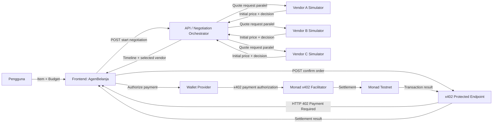

# AgenBelanja — Architecture Specification

## Tujuan Arsitektur

Menyediakan arsitektur MVP yang cepat dibuat, mudah didemokan, dan tahan terhadap kegagalan integrasi. Negosiasi harus tetap berjalan bila x402 atau wallet belum siap; payment menjadi tahap terakhir setelah agent berhasil memilih vendor.

## Prinsip Arsitektur

- **Mock-first:** vendor menggunakan simulator terkontrol, bukan API vendor nyata.
- **Deterministic agent:** keputusan harga menggunakan rule engine, bukan LLM.
- **Parallel by design:** tiga quote dipanggil bersama menggunakan `Promise.all` atau mekanisme setara.
- **On-chain last:** interaksi x402/Monad hanya dimulai setelah ada vendor terpilih.
- **Graceful fallback:** core demo negosiasi tidak boleh bergantung pada settlement nyata.
- **No secrets in client:** private key, facilitator secret, atau kredensial server tidak boleh dikirim ke browser.

## Diagram Sistem



## Komponen

| Komponen | Tanggung Jawab | MVP |
| --- | --- | --- |
| Frontend | Input item/budget, tampilkan vendor, timeline, hasil negosiasi, dan status payment | Wajib |
| Negotiation Orchestrator | Menjalankan vendor simulator paralel dan rule engine | Wajib |
| Vendor Simulator | Mengembalikan quote dan accept/reject berdasarkan floor price | Wajib |
| Order State | Menyimpan state proses pada memory/session untuk satu demo | Wajib |
| x402 Protected Endpoint | Memberi 402 sebelum payment dan mengonfirmasi order setelah payment | Penting |
| Wallet Provider | Menghubungkan wallet dan meminta approval payment | Penting |
| Monad x402 Facilitator | Memverifikasi/memfasilitasi x402 payment | Penting |
| Monad Testnet | Layer settlement testnet | Penting |

## Data State Minimum

```ts
type OrderStatus =
  | 'DRAFT'
  | 'NEGOTIATING'
  | 'NEGOTIATION_COMPLETE'
  | 'NO_DEAL'
  | 'PAYMENT_REQUIRED'
  | 'PAYMENT_PROCESSING'
  | 'SETTLEMENT_SUCCESS'
  | 'SETTLEMENT_FAILED';

type VendorStatus =
  | 'WAITING'
  | 'QUOTED'
  | 'NEGOTIATING'
  | 'ACCEPTED'
  | 'REJECTED'
  | 'SELECTED';

type Vendor = {
  vendorId: 'vendor_a' | 'vendor_b' | 'vendor_c';
  vendorName: string;
  initialPrice: number;
  floorPrice: number;
};

type NegotiationEvent = {
  eventId: string;
  sequenceNumber: number;
  timestamp: string;
  actor: 'agent' | 'vendor_a' | 'vendor_b' | 'vendor_c' | 'system';
  eventType: string;
  message: string;
  amount?: number;
};

type Order = {
  orderId: string;
  itemDescription: string;
  budgetAmount: number;
  status: OrderStatus;
  selectedVendorId?: string;
  finalPrice?: number;
  timeline: NegotiationEvent[];
  transactionReference?: string;
};
```

## Rule Engine

```text
Input: item_description, budget_amount, daftar vendor

1. Jalankan requestQuote(vendor) untuk semua vendor secara paralel.
2. Jika satu atau lebih initial_price <= budget_amount:
   a. Pilih harga terendah.
   b. Jika seri, pilih vendor berdasarkan vendor_id alfabetis.
   c. Set selected vendor dan NEGOTIATION_COMPLETE.
3. Jika tidak ada harga awal yang sesuai:
   a. Kirim counterOffer sebesar budget_amount ke semua vendor secara paralel.
   b. Vendor menerima jika budget_amount >= floor_price.
   c. Dari vendor yang menerima, pilih final_price terendah.
   d. Jika tidak ada yang menerima, set NO_DEAL.
4. final_price tidak boleh > budget_amount.
5. Tidak ada payment bila status bukan NEGOTIATION_COMPLETE.
```

## API Contract Minimum

### POST `/api/orders/negotiate`

Request:

```json
{
  "itemDescription": "Headset gaming",
  "budgetAmount": 50,
  "scenario": "negotiation_success"
}
```

Response:

```json
{
  "orderId": "order_demo_001",
  "status": "NEGOTIATION_COMPLETE",
  "selectedVendorId": "vendor_b",
  "finalPrice": 50,
  "timeline": []
}
```

### POST `/api/orders/:orderId/confirm`

Prasyarat:

- Order ditemukan.
- Status order adalah `NEGOTIATION_COMPLETE`.
- `selectedVendorId` dan `finalPrice` tersedia.

Perilaku:

- Tanpa bukti payment valid: kembalikan `HTTP 402 Payment Required`.
- Dengan payment valid: set `SETTLEMENT_SUCCESS` dan kembalikan receipt.
- Bila settlement gagal: set `SETTLEMENT_FAILED` dan kembalikan error yang aman untuk UI.

Response sukses contoh:

```json
{
  "orderId": "order_demo_001",
  "status": "SETTLEMENT_SUCCESS",
  "selectedVendorId": "vendor_b",
  "finalPrice": 50,
  "transactionReference": "0x..."
}
```

## Environment Variables

```bash
NEXT_PUBLIC_X402_NETWORK=eip155:10143
NEXT_PUBLIC_MONAD_RPC_URL=https://testnet-rpc.monad.xyz
NEXT_PUBLIC_MONAD_USDC_ADDRESS=0x534b2f3A21130d7a60830c2Df862319e593943A3
NEXT_PUBLIC_X402_FACILITATOR_URL=https://x402-facilitator.molandak.org
PAY_TO_ADDRESS=
X402_DEMO_PRICE_USDC=0.001
DEMO_PAYMENT_MODE=false
```

## Fallback Payment Mode

Aktifkan hanya apabila integrasi x402 nyata belum dapat diselesaikan dalam timebox.

```text
DEMO_PAYMENT_MODE=true
```

Perilaku fallback:

1. Endpoint confirm tetap mengembalikan state `PAYMENT_REQUIRED`/402 pada percobaan pertama.
2. Frontend menampilkan modal authorization simulasi.
3. Setelah pengguna mengonfirmasi, endpoint mengembalikan `SETTLEMENT_SUCCESS` atau mode gagal terkontrol.
4. UI diberi badge `Demo Payment Mode`.
5. README menyatakan dengan jelas bahwa fallback bukan settlement on-chain nyata.

## Urutan Implementasi

1. Buat vendor simulator dan seed scenarios.
2. Implementasikan rule engine serta test skenario sukses/no-deal.
3. Implementasikan endpoint negotiate.
4. Buat UI form, vendor cards, timeline, dan result card.
5. Sambungkan UI ke endpoint negotiate.
6. Tambahkan endpoint confirm yang memvalidasi status order.
7. Timebox integrasi x402 + wallet + Monad Testnet.
8. Tambahkan fallback payment mode jika diperlukan.
9. Uji ulang seluruh demo flow dari refresh browser.

## Risiko dan Mitigasi

| Risiko | Dampak | Mitigasi |
| --- | --- | --- |
| Wallet tidak terhubung | Payment tidak dapat didemo | Tampilkan CTA connect wallet dan gunakan fallback demo mode bila diizinkan |
| x402 setup belum berhasil | Settlement nyata tidak selesai | Timebox 60 menit dan aktifkan fallback flow jujur |
| Testnet/faucet bermasalah | Tidak ada gas/token testnet | Pastikan wallet dan token disiapkan sebelum build bila aturan hackathon mengizinkan |
| Agent logic terlalu kompleks | Bug dan waktu habis | Batasi satu counter-offer dan rule engine sederhana |
| State hilang setelah refresh | Demo terputus | Gunakan seed scenario, reset button, dan in-memory state yang mudah dibuat ulang |
| Vendor response tidak terlihat paralel | Nilai Monad tidak tampak | Tambahkan event timeline dan timestamp relatif untuk setiap quote |
