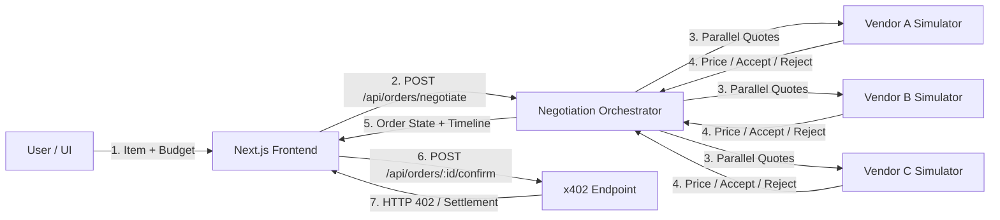

# AgenBelanja — Design Specification

## Overview

AgenBelanja is an agentic commerce negotiation application built for Monad. The application accepts a purchase item description and a budget limit from the user, concurrently queries quotes from three simulated vendors using parallel execution, negotiates a counter-offer if initial quotes exceed budget (ensuring offers never exceed budget), selects the optimal accepted vendor offer, and completes settlement via the x402 HTTP standard protocol on Monad Testnet (with an honest fallback mode `DEMO_PAYMENT_MODE=true` if live x402 facilitator is unavailable).

## Core Principles & Guardrails (Ponytail)

- **YAGNI & Minimal Complexity**: No AI/LLM APIs, no user logins, no databases, no product catalogs, no custom smart contracts, no admin dashboards, no vendor reputation systems.
- **Deterministic Rule Engine**: Negotiation logic is 100% deterministic TypeScript rules.
- **Parallel Quoting**: 3 vendor quotes requested simultaneously using `Promise.all`.
- **Budget Integrity**: The agent strictly never offers or accepts a price above the user's budget.
- **On-chain / Payment Last**: Monad x402 settlement happens only after negotiation completes successfully.

## System Architecture



## Data Types

```ts
export type OrderStatus =
  | 'DRAFT'
  | 'NEGOTIATING'
  | 'NEGOTIATION_COMPLETE'
  | 'NO_DEAL'
  | 'PAYMENT_REQUIRED'
  | 'PAYMENT_PROCESSING'
  | 'SETTLEMENT_SUCCESS'
  | 'SETTLEMENT_FAILED';

export type VendorStatus =
  | 'WAITING'
  | 'QUOTED'
  | 'NEGOTIATING'
  | 'ACCEPTED'
  | 'REJECTED'
  | 'SELECTED';

export type VendorId = 'vendor_a' | 'vendor_b' | 'vendor_c';

export type Vendor = {
  vendorId: VendorId;
  vendorName: string;
  initialPrice: number;
  floorPrice: number;
};

export type NegotiationEvent = {
  eventId: string;
  sequenceNumber: number;
  timestamp: string;
  actor: 'agent' | VendorId | 'system';
  eventType: 'QUOTE_REQUEST' | 'QUOTE_RECEIVED' | 'COUNTER_OFFER' | 'VENDOR_RESPONSE' | 'VENDOR_SELECTED' | 'NO_DEAL';
  message: string;
  amount?: number;
};

export type Order = {
  orderId: string;
  itemDescription: string;
  budgetAmount: number;
  status: OrderStatus;
  selectedVendorId?: VendorId;
  selectedVendorName?: string;
  initialPrice?: number;
  finalPrice?: number;
  savings?: number;
  timeline: NegotiationEvent[];
  transactionReference?: string;
};
```

## Seed Scenarios

1. **Scenario 1 — Instant Match**
   - Item: Mechanical Keyboard, Budget: 50 USDC
   - Vendor A: Initial 48 USDC (Floor 45) -> Selected immediately at 48 USDC.
   - Vendor B: Initial 55 USDC (Floor 50)
   - Vendor C: Initial 62 USDC (Floor 56)

2. **Scenario 2 — Successful Negotiation**
   - Item: Gaming Headset, Budget: 50 USDC
   - Vendor A: Initial 58 USDC (Floor 52) -> Rejects counter-offer (50 < 52)
   - Vendor B: Initial 60 USDC (Floor 49) -> Accepts counter-offer (50 >= 49) -> Selected at 50 USDC.
   - Vendor C: Initial 64 USDC (Floor 57) -> Rejects counter-offer (50 < 57)

3. **Scenario 3 — All Reject (No Deal)**
   - Item: Wireless Mouse, Budget: 35 USDC
   - Vendor A: Initial 48 USDC (Floor 42) -> Rejects counter-offer (35 < 42)
   - Vendor B: Initial 45 USDC (Floor 40) -> Rejects counter-offer (35 < 40)
   - Vendor C: Initial 52 USDC (Floor 45) -> Rejects counter-offer (35 < 45)
   - Result: NO_DEAL, payment button disabled.

## API Contracts

### `POST /api/orders/negotiate`
- **Request Body**: `{ "itemDescription": string, "budgetAmount": number, "scenarioId"?: "scenario_1" | "scenario_2" | "scenario_3" }`
- **Response**: `Order` object with updated status (`NEGOTIATION_COMPLETE` or `NO_DEAL`) and detailed `timeline` sequence.

### `POST /api/orders/[orderId]/confirm`
- **Request Body**: `{ "paymentAuth"?: string }`
- **Behavior**:
  - Without valid payment proof: returns HTTP 402 status with `PAYMENT_REQUIRED` payload.
  - With payment proof or under `DEMO_PAYMENT_MODE=true`: updates order to `SETTLEMENT_SUCCESS` with transaction reference hash (`0x...`).

## User Interface Design

1. **Header**: Title, Monad Testnet indicator, Wallet Connection status badge, and Demo Scenario Preset buttons.
2. **Form & Budget Input**: Inputs for item name and budget with real-time validation.
3. **Vendor Status Cards**: 3 cards showing real-time status badges (`WAITING`, `QUOTED`, `NEGOTIATING`, `ACCEPTED`, `REJECTED`, `SELECTED`), initial price, floor price (dimmed for transparency), and status indicators.
4. **Negotiation Sequence Timeline**: Animated chronological log of agent events, quote requests, counter-offers, and decisions.
5. **Result & Payment Panel**: Vendor choice summary, savings calculation, and x402 payment button (active only on `NEGOTIATION_COMPLETE`).
